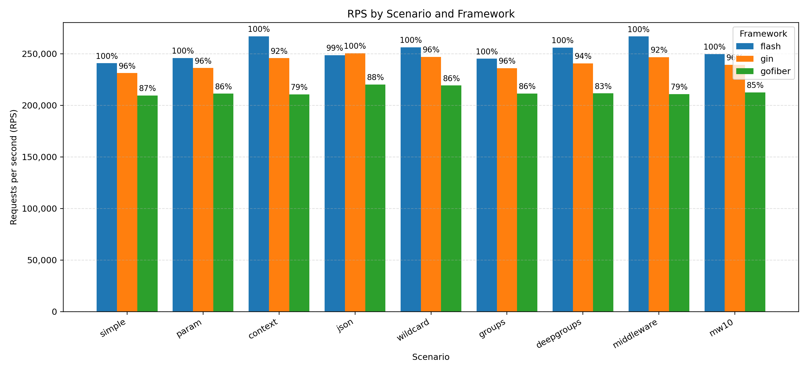

**A fast, minimal, modular HTTP framework for Go, built on net/http. Ergonomics you love from Fiber, reliability and compatibility you expect from Gin.**

[](https://pkg.go.dev/github.com/goflash/flash)
<a href="https://goreportcard.com/report/github.com/goflash/flash">
    
</a>
[](https://codecov.io/gh/goflash/flash)
<a href="https://github.com/goflash/flash/actions?query=workflow%3ATest">
    
</a>

<a href="https://docs.goflash.dev">
    
</a>


---

## Quick Start

```go
package main

import (
    "log"
    "net/http"

    "github.com/goflash/flash/v1"
    mw "github.com/goflash/flash/middleware"
)

func main() {
    app := flash.New()

    app.Use(mw.Recover(), mw.Logger())

    app.GET("/hello/:name", func(c *flash.Ctx) error {
        return c.JSON(map[string]any{"hello": c.Param("name")})
    })

    log.Fatal(http.ListenAndServe(":8080", app))
}
```

> More examples 📁: Browse the runnable examples in [examples](./examples/).

---

## Overview

- 🎯 Purpose: Productive HTTP framework with a tiny, composable core and batteries-included middlewares.
- 📐 Philosophy: Standard library first, high performance without gimmicks, small API surface.
- 👥 Who is it for: Teams that need Gin-like safety and net/http compatibility with Fiber-like ergonomics.
- 🧩 API: Clean, minimal, and ergonomic—`flash.New()`, `flash.Ctx`, and composable middleware.
- 🔗 Interop & compatibility: 100% net/http, HTTP/2-ready; mount any `http.Handler`, and `App` is an `http.Handler`.
- 🔌 Extensibility: Add your own middleware, plug in any logger (slog, zap, zerolog), and compose freely.
- 🔭 Observability: Built-in OpenTelemetry tracing, structured logging, and request context helpers.
- 🚀 Modern Go: Designed for Go 1.22+, leverages context, slog, and best practices for performance and safety.
- 🛡️ Security: Safe defaults; optional CSRF, timeouts, rate limiting, and session hardening via middleware.
- 🛠️ Support: Works with standard tooling (net/http, HTTP/2, pprof, Prometheus, OpenTelemetry).
- 🚧 Stability: Alpha; small, explicit API. SemVer from v1.0; minor breaking changes possible until then.
- 🧭 Scope: Minimal core by design; advanced patterns live in middleware and the examples catalog.

> Note ✅: This README shows only minimal examples. For complete, runnable samples, see the examples directory: [examples](./examples/).

---

## Features

| Feature                    | Description & Rationale                                                                                          |
| -------------------------- | ---------------------------------------------------------------------------------------------------------------- |
| **net/http compatible**    | `App` implements `http.Handler` for seamless integration with Go’s ecosystem and HTTP/2 readiness.               |
| **Fast routing**           | High-performance router (httprouter): supports all HTTP verbs, route groups, and middleware composition.         |
| **Ergonomic context**      | `flash.Ctx` provides clean helpers: `Param`, `Query`, `BindJSON`, `JSON`, `String`, `Header`, etc.               |
| **Composable middleware**  | Global and per-route middleware, inspired by Gin/Fiber, for logging, recovery, CORS, and more.                   |
| **Built-in middleware**    | Logger, Recover, CORS, Timeout, OpenTelemetry, Sessions, Gzip, Request ID, Rate Limit, Buffer.                   |
| **Validation helpers**     | Integrated with go-playground/validator for robust request validation and field error mapping.                   |
| **Static files**           | Serve static assets with `App.Static` or multiple folders with `App.StaticDirs` (first match wins).              |
| **Hooks & error handling** | Custom `OnError`, `NotFound`, and `MethodNA` for full control over error and 404/405 responses.                  |
| **Mounting/Interop**       | Mount any `http.Handler` or ServeMux; easy migration and integration with legacy or third-party code.            |
| **Pluggable logging**      | Use any slog-compatible logger (slog, zap, zerolog); logger is injected into request context.                    |
| **Observability**          | Built-in OpenTelemetry tracing middleware for distributed tracing and metrics.                                   |
| **Session management**     | In-memory sessions with cookie/header ID; extensible for custom stores.                                          |
| **Performance**            | Pooled buffers, precomputed Content-Length, pooled gzip writers, and efficient write buffering.                  |
| **Extensible**             | Add your own middleware, context helpers, or validation logic; batteries-included but not batteries-opinionated. |
| **Modern Go**              | Designed for Go 1.22+, leverages context, slog, and idiomatic error handling.                                    |
| **Examples**               | Real-world, runnable examples for all features: cookies, templates, WebSockets, shutdown, and more.              |

> Tip 💡: Every feature is included to maximize developer productivity, safety, and performance, while keeping the API minimal and explicit. No hidden magic, no global state, no surprises.

### Performance highlights

- Pooled JSON buffers for minimal allocations and fast serialization.
- Precomputed Content-Length for JSON, String, and Send responses (avoids chunked encoding, improves client performance).
- Pooled gzip writers per compression level for efficient, low-GC response compression.
- Optional write Buffer middleware: reduces syscalls, sets Content-Length, and auto-streams large payloads.
- Request context pooling: reuses context objects to minimize GC pressure and latency.
- Minimal allocations in routing and context handling (leverages httprouter and custom context pooling).
- Fast middleware chain: zero reflection, no global state, and no hidden allocations.
- All features are opt-in: no performance penalty for unused middleware or helpers.

---

## Why `GoFlash` vs Gin/Fiber/Others

GoFlash is designed to combine the best of Gin and Fiber, while addressing their key limitations for modern, professional Go development:

| Capability                  | Gin           | Fiber                 | GoFlash                               |
| --------------------------- | ------------- | --------------------- | ------------------------------------- |
| net/http compatible         | ✅ Yes         | ❌ No (fasthttp)       | ✅ Yes                                 |
| HTTP/2 readiness            | ✅ Yes         | ❌ No (adapter needed) | ✅ Yes                                 |
| Fast routing                | ✅ Yes         | ✅ Yes                 | ✅ Yes (httprouter)                    |
| Friendly context helpers    | ✅ Yes         | ✅ Yes                 | ✅ Yes (small API)                     |
| Middleware chaining         | ✅ Yes         | ✅ Yes                 | ✅ Yes (global + per-route)            |
| Route groups                | ✅ Yes         | ✅ Yes                 | ✅ Yes                                 |
| Validation helpers          | ☑️ Indirect    | ☑️ Indirect            | ✅ Yes (validator integrations)        |
| Tracing (OTel)              | ☑️ Via contrib | ☑️ Via contrib         | ✅ Built-in middleware                 |
| Sessions                    | ☑️ Via contrib | ☑️ Via contrib         | ✅ Built-in (in-memory, cookie/header) |
| Gzip/Request ID/Rate Limit  | ☑️ Via contrib | ☑️ Via contrib         | ✅ Built-in                            |
| Works with std http.Handler | ✅ Yes         | ❌ No                  | ✅ Yes (Mount/HandleHTTP)              |
| Graceful shutdown           | ✅ Yes         | ☑️ Partial             | ✅ Yes (context-aware)                 |
| HTTP/3 future-proof         | ✅ Yes         | ❌ No                  | ✅ Yes                                 |
| Extensible core             | ✅ Yes         | ✅ Yes                 | ✅ Yes (modular, opt-in)               |
| Modern Go idioms            | ☑️ Partial     | ☑️ Partial             | ✅ Yes (Go 1.22+, slog, context)       |

### Key differences and rationale

- **Standard library compatibility:** GoFlash is 100% net/http, so you get HTTP/2+, context cancellation, and all Go ecosystem tools out of the box—no adapters, no surprises.
- **Performance without trade-offs:** Like Fiber, GoFlash uses pooling and zero-allocation patterns, but never sacrifices reliability or compatibility. You get near-Fiber speed with Gin-level safety.
- **Minimal, ergonomic API:** Inspired by Fiber’s expressiveness and Gin’s clarity, GoFlash offers a small, explicit API—no magic, no global state, no hidden costs.
- **Batteries-included, but modular:** All common middleware (logging, recovery, CORS, tracing, sessions, gzip, rate limit, buffer) are built-in and opt-in. You only pay for what you use.
- **Observability and production readiness:** OpenTelemetry tracing, structured logging, and context helpers are first-class, not afterthoughts. Graceful shutdown and error handling are built-in.
- **Extensible and future-proof:** Designed for microservices, monoliths, and serverless. Clean project structure, easy to add your own middleware, and ready for new Go features (e.g., generics, slog).
- **Professional developer experience:** Clear docs, real-world examples, and a focus on explicitness and safety. No hidden magic, no global state, and no “gotchas” for teams scaling up.

> Note 📎: GoFlash is for teams who want the speed and ergonomics of Fiber, the reliability and compatibility of Gin, and the flexibility to build anything from microservices to large-scale backends—without compromise.

---

## Install

```bash
go get github.com/goflash/flash
```

If an example uses extra deps (e.g., [gorilla/websocket](https://github.com/gorilla/websocket), [OpenTelemetry](https://opentelemetry.io/)), run `go mod tidy` at repo root.

---

## Core Concepts

### Routing

- Register routes with methods or `ANY()`. Group routes with shared prefix and middleware. Nested groups are supported and inherit parent prefix and middleware.
- Custom methods: use `Handle(method, path, handler)` for non-standard verbs.
- Mount net/http handlers with `Mount` or `HandleHTTP`.

#### Pattern reference

Routing patterns and behavior follow julienschmidt/httprouter. See:

- Named params: <https://github.com/julienschmidt/httprouter#named-parameters>
- Catch‑all (trailing wildcard): <https://github.com/julienschmidt/httprouter#catch-all-parameters>
- Trailing slash redirect rules: <https://github.com/julienschmidt/httprouter?tab=readme-ov-file#features>
- Automatic OPTIONS and Method Not Allowed: <https://github.com/julienschmidt/httprouter?tab=readme-ov-file#features>

### Context (Ctx)

flash.Ctx is a thin, pooled wrapper around http.ResponseWriter and *http.Request, designed for both ergonomics and performance. All helpers are explicit, chainable where appropriate, and safe for high-concurrency use.

| Method                       | Purpose / Rationale                                                                                |
| ---------------------------- | -------------------------------------------------------------------------------------------------- |
| `Request()`                  | Returns the underlying *http.Request for advanced/interop use.                                     |
| `SetRequest(r)`              | Replace the request (e.g., to propagate context or swap in a new request).                         |
| `ResponseWriter()`           | Returns the underlying http.ResponseWriter for low-level control.                                  |
| `SetResponseWriter(w)`       | Replace the underlying http.ResponseWriter (e.g., for gzip or buffer middleware).                  |
| `WroteHeader()`              | Reports whether the response header has been written.                                              |
| `Context()`                  | Returns the request context for cancellation, deadlines, tracing, etc.                             |
| `Set(key, value)`            | Store a value on the request context (clones request with context.WithValue).                      |
| `Get(key [,def])`            | Retrieve a value from the request context; returns def if provided and missing, else nil.          |
| `Method()`                   | Returns the HTTP method (GET, POST, etc).                                                          |
| `Path()`                     | Returns the request URL path.                                                                      |
| `Route()`                    | Returns the matched route pattern (e.g., `/users/:id`).                                            |
| `Param(name)`                | Returns a path parameter by name.                                                                  |
| `Query(key)`                 | Returns a query string parameter by key.                                                           |
| `Status(code)`               | Sets the response status code (chainable, does not write header yet).                              |
| `StatusCode()`               | Returns the status code that will be written (or 200 if not set yet).                              |
| `Header(key, value)`         | Sets a response header.                                                                            |
| `SetJSONEscapeHTML(bool)`    | Controls whether JSON responses escape HTML (default true, for XSS safety).                        |
| `JSON(v)`                    | Writes a value as JSON, sets Content-Type/Length, and status (uses pooled buffer for performance). |
| `String(status, body)`       | Writes a plain text response with status and body.                                                 |
| `Send(status, type, []byte)` | Writes raw bytes with status and content type.                                                     |
| `BindJSON(&v)`               | Strictly decodes request body JSON into v (unknown fields rejected, closes body).                  |
| `Finish()`                   | Finalizes the context (reserved for future buffer reuse, currently a no-op).                       |
| `Reset(w, r, ps, route)`     | Internal: resets the context for pooling (not for user code).                                      |

> All methods are designed for explicitness, safety, and performance. You always have access to the underlying http types for advanced use, but the ergonomic helpers cover 99% of use cases.

### Mounting/Interop

GoFlash is designed for seamless interoperability with the entire Go HTTP ecosystem. You can mount any `http.Handler`, `http.ServeMux`, or compatible router directly into your GoFlash app, making it easy to:

- Incrementally migrate legacy net/http codebases
- Integrate third-party routers, middleware, or microservices
- Share routes and handlers between GoFlash and standard library servers

#### Mounting http.Handler or ServeMux

Use `app.Mount(prefix, handler)` to attach any `http.Handler` (including `http.ServeMux`, other frameworks, or legacy code) under a path prefix. All requests matching the prefix are routed to the mounted handler, with the prefix stripped from the request URL (like Gin's `Group` or Fiber's `Mount`).

```go
// Mount a legacy net/http mux under /api/
mux := http.NewServeMux()
mux.HandleFunc("/users", func(w http.ResponseWriter, r *http.Request) {
    w.Write([]byte("legacy users"))
})
app.Mount("/api/", mux)
```

#### Mounting a single http.Handler on a route

Use `app.HandleHTTP(method, path, handler)` to register a single `http.Handler` for a specific method and path. This is ideal for integrating existing handlers or third-party libraries that expect net/http signatures.

```go
// Mount a single handler for GET /status
app.HandleHTTP("GET", "/status", http.HandlerFunc(func(w http.ResponseWriter, r *http.Request) {
    w.Write([]byte("ok"))
}))
```

> Static files 📦: Serve from one or more directories under a prefix. First existing file wins.
>
> ```go
> // Single directory
> app.Static("/assets/", "./public")
>
> // Multiple directories (e.g., override pub with build output)
> app.StaticDirs("/assets/", "./public", "./dist")
> ```

#### Migration and Interop Patterns

- **Incremental migration:** Start by mounting your existing `http.ServeMux` or legacy handlers, then gradually move routes to GoFlash for improved ergonomics and middleware support.
- **Third-party integration:** Use `Mount` or `HandleHTTP` to plug in routers or handlers from other libraries (e.g., Prometheus, pprof, grpc-gateway) without adapters.
- **Full net/http compatibility:** GoFlash apps are themselves `http.Handler`, so you can embed them in other servers, reverse proxies, or test harnesses.

#### Advanced: Composing with net/http

You can use GoFlash as a sub-router in a larger net/http application, or vice versa:

```go
// Use GoFlash as a sub-router in a standard net/http mux
app := flash.New()
// ...register routes...
mux := http.NewServeMux()
mux.Handle("/api/", http.StripPrefix("/api", app))
log.Fatal(http.ListenAndServe(":8080", mux))
```

> Interop 🔗: GoFlash is designed for zero-friction interop: no adapters, no wrappers, just standard Go interfaces. This makes it ideal for gradual adoption, microservices, and complex architectures.

### Logging

- GoFlash uses Go's standard slog for framework logging.
- Provide your own logger via `app.SetLogger(*slog.Logger)`.
- Middlewares pull the logger from request context.

```go
logger := slog.New(slog.NewJSONHandler(os.Stdout, &slog.HandlerOptions{Level: slog.LevelInfo}))
app.SetLogger(logger)
app.Use(mw.Logger())
```

Adapters

- You can plug zap/zerolog via slog-compatible handlers (community adapters), keeping the GoFlash API stable.

---

## Built-in Middleware

| Middleware                                     | Purpose                                                                 | Key Options                                                                                                              |
| ---------------------------------------------- | ----------------------------------------------------------------------- | ------------------------------------------------------------------------------------------------------------------------ |
| [Logger](middleware/logger.go)                 | Simple request logging                                                  | —                                                                                                                        |
| [Recover](middleware/recover.go)               | Panic safety to 500                                                     | —                                                                                                                        |
| [CORS](middleware/cors.go)                     | Cross-origin rules                                                      | `Origins`, `Methods`, `Headers`, `Credentials`                                                                           |
| [Timeout](middleware/timeout.go)               | Per-route deadline                                                      | `Duration`, custom timeout handler                                                                                       |
| [OpenTelemetry](middleware/otel.go)            | Server spans + attributes + status mapping                              | `Tracer`, `Propagator`, `Filter`, `SpanName`, `Attributes`, `Status`, `RecordDuration`, `ServiceName`, `ExtraAttributes` |
| [Sessions](middleware/session.go)              | Cookie or header session ID, in-memory store                            | `TTL`, `CookieName`, `HeaderName`, etc.                                                                                  |
| [Gzip](middleware/gzip.go)                     | Response compression with pooled writers                                | `Level`                                                                                                                  |
| [Request ID](middleware/requestid.go)          | Ensure/echo request ID header and put into context                      | `Header` (default `X-Request-ID`)                                                                                        |
| [Rate Limit](middleware/ratelimit.go)          | Token bucket per client IP                                              | `Limiter`, `Header` (Retry-After)                                                                                        |
| [Buffer](middleware/buffer.go)                 | Pooled write buffer; sets Content-Length; auto-stream on large payloads | `InitialSize`, `MaxSize`                                                                                                 |
| [CSRF](middleware/csrf.go)                     | Double-submit cookie CSRF protection (optional)                         | `CookieName`, `HeaderName`, `TokenLength`, `TTL`, etc.                                                                   |
| [Validator I18n](middleware/validator_i18n.go) | Per-request localized validation messages                               | `DefaultLocale`, `LocaleFromCtx`, `MessageFuncFor` (required), `SetGlobal`                                               |

### Usage

```go
// Enable CSRF protection (optional, for forms or APIs)
app.Use(mw.CSRF())
// Or with custom config:
app.Use(mw.CSRF(mw.CSRFConfig{
    CookieName: "_csrf", HeaderName: "X-CSRF-Token", TokenLength: 32,
}))
```

```go
// Provide custom slog logger
logger := slog.New(slog.NewJSONHandler(os.Stdout, &slog.HandlerOptions{Level: slog.LevelInfo}))
app.SetLogger(logger)

// Enable structured logging
app.Use(mw.Logger())
```

> Security ⚠️: CSRF is recommended for form posts or cookie-authenticated APIs.

---

## Observability (OpenTelemetry)

- Adds a span per request with attributes: method, route, target, status, peer info.
- Propagates context for downstream services. Errors map to span status.

### Example

```go
app := flash.New()
// Quick start: service name and optional extra attributes
app.Use(mw.OTel("my-service", attribute.String("env", "dev")))
```

> Advanced 📡: For full control (`Filter`, custom `SpanName`, extra attributes, custom `Status` mapping, duration recording), use `mw.OTelWithConfig(...)`. See the complete example in [examples/otel](./examples/otel).

> Note 📝: Prefer setting `service.name` on the OpenTelemetry Resource when configuring your `TracerProvider`. The middleware `ServiceName` is a convenience for simple setups.

---

## Validation

Use [go-playground/validator](https://github.com/go-playground/validator) via the `validate` package. Error fields use JSON tag names.

```go
import (
    "net/http"
    "github.com/goflash/flash/validate"
)

type Signup struct {
    Email string `json:"email" validate:"required,email"`
    Age   int    `json:"age" validate:"required,min=13"`
}

app.POST("/signup", func(c *flash.Ctx) error {
    var in Signup
    if err := c.BindJSON(&in); err != nil {
        return c.Status(http.StatusBadRequest).JSON(map[string]any{"error": "invalid json"})
    }
    if err := validate.Struct(in); err != nil {
        return c.Status(http.StatusUnprocessableEntity).JSON(map[string]any{
            "message": "validation failed",
            "fields":  validate.ToFieldErrors(err),
        })
    }
    return c.JSON(map[string]any{"ok": true})
})
```

### Localized messages (i18n)

Use the ValidatorI18n middleware to translate validation messages per request. By default it looks at the `:lang` route param if present.

```go
// Prepare translators and register validator translations once (setup not shown)
// translators := map[string]ut.Translator{"en": enTr, "es": esTr}

app.Use(middleware.ValidatorI18n(middleware.ValidatorI18nConfig{
    DefaultLocale: "en",
    MessageFuncFor: func(locale string) func(validator.FieldError) string {
        tr := translators[locale]
        if tr == nil { tr = translators["en"] }
        return func(fe validator.FieldError) string { return fe.Translate(tr) }
    },
}))

// With routes like /:lang/..., locale is taken from :lang by default
app.POST(":lang/signup", func(c *flash.Ctx) error {
    var in Signup
    if err := c.BindJSON(&in); err != nil {
        return c.Status(400).JSON(map[string]any{"fields": validate.ToFieldErrors(err)})
    }
    if err := validate.Struct(in); err != nil {
        return c.Status(422).JSON(map[string]any{
            // Uses request-scoped translator set by middleware
            "fields": validate.ToFieldErrorsWithContext(c.Context(), err),
        })
    }
    return c.JSON(map[string]any{"ok": true})
})
```

> See the full i18n example in [examples/validation_with_i18n](./examples/validation_with_i18n).

---

## Sessions

- In-memory store with cookie or header-based session IDs.
- Per-request `Session` via `mw.SessionFromCtx(c)` with `Get/Set/Delete`.

```go
app.Use(mw.Sessions(mw.SessionConfig{ TTL: 24*time.Hour }))
app.GET("/me", func(c *flash.Ctx) error {
    s := mw.SessionFromCtx(c)
    s.Set("user", "u1")
    return c.JSON(map[string]any{"user": "u1"})
})
```

---

## Performance Notes

- JSON/String/Send set Content-Length when possible to avoid chunked responses where not needed.
- JSON uses a pooled buffer to minimize allocations; disable HTML escaping via `SetJSONEscapeHTML(false)` when safe.
- Gzip writers are pooled per compression level.
- Buffer middleware reduces syscalls by buffering responses and auto-switches to streaming when exceeding `MaxSize`.
- Request ID is available on the request context for low-overhead correlation in logs.

> Tip ⚡️: For APIs with small/medium payloads, combining `Buffer`, `Gzip`, and precomputed `Content-Length` yields excellent performance with low GC pressure.

---

## All Examples

Run any example:

```bash
# Root-managed examples
go run ./examples/basic

# Examples with their own go.mod (run from the folder)
cd examples/otel && go run .
cd examples/custom_logger_zap && go run .
cd examples/websocket && go run .
```

> Explore more in examples: cookies, sessions, CSRF, templates, WebSockets, graceful shutdown, groups, and more. See [examples](./examples/).

---

## Benchmarks

We benchmarked GoFlash against Gin and Fiber across a representative set of scenarios:

1. Simple ping/pong endpoint
2. Reading a URL path parameter
3. Writing to and reading from request context
4. JSON binding with validation
5. Trailing-wildcard route parsing
6. Basic route group
7. Route groups nested 10 levels deep
8. Single middleware
9. Chain of 10 middlewares

Environment and methodology:

- Hardware: Apple MacBook Pro (M3, 32 GB RAM)
- Load generator: wrk with 11 threads and 256 concurrent connections
- Each scenario uses functionally equivalent handlers, routing patterns, and middleware across frameworks
- Servers run with release/production settings where applicable
- Results are indicative; performance varies with workload, configuration, and environment

<!-- markdownlint-disable-next-line MD033 -->


For more details: <https://github.com/goflash/benchmarks>

---

## Contributing

We welcome issues and PRs! Please read [CONTRIBUTING.md](./CONTRIBUTING.md).

---

<div align="center">

**⭐ Star this repo if you find it useful!**

[](https://github.com/goflash/flash/stargazers)

---

<small>

**📝 License**: MIT | **🔄 Last Updated**: August 2025 | **📧 Support**: [Create an Issue]([../../issues](https://github.com/goflash/flash/issues))

Battle tested in private productions.
<br/> Released with ❤️ for the Go community.

</small>

</div>
